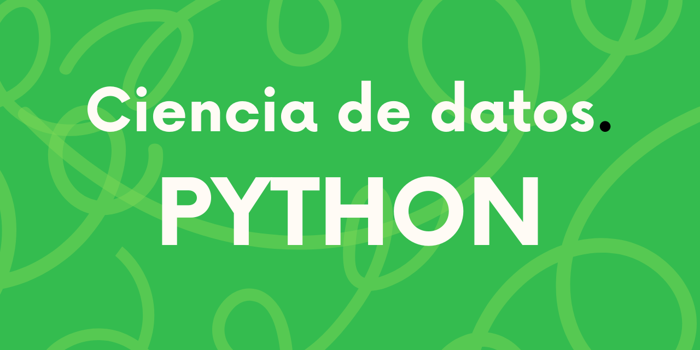

# Curso de ciencia de datos con Python

### ¿Que aremos a lo largo del curso?

### Preparativos

#### Preparacion de nuestro entorno local de trabajo

#### Trabajando en un entorno sobre la nube.

#### Fundamentos de Python

## Python Aplicado a la ciencia de datos

### Punto de Partida - Definicion de una Hipotesis.

### Consumiendo Datos

### Tratamiento de Datos

### Analisis de Datos

### Metodos de Visualizacion

### Metodos de Prediccion y estamacion de Resultados

### Presentacion de resultados

## ¿A hora que sigue?
